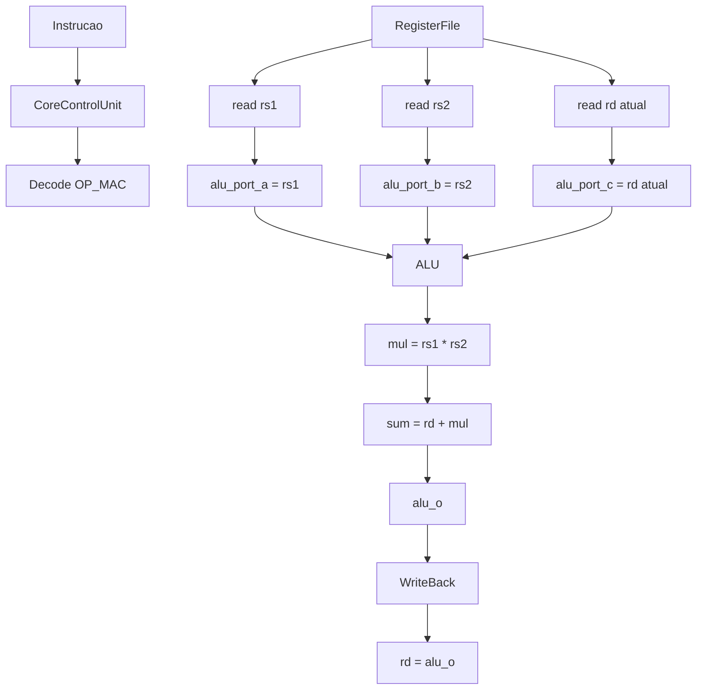

# MAC Operation — Componentes alterados

## Visão geral
A operação `OP_MAC` foi implementada como uma operação customizada do tipo:

`rd = rd + rs1 * rs2`

Para isso, foi necessário ajustar o caminho de dados da ALU para receber um terceiro valor de entrada, que representa o valor antigo do registrador destino (`rd`).

---

## Componentes alterados

### 1) ArithmeticLogicUnit.sv
Arquivo: `src/single_cycle_processor/ArithmeticLogicUnit.sv`

Mudança principal:
- adição da porta `alu_port_c_i`
- substituição da operação incompleta:

```systemverilog
OP_MAC: alu_o += alu_port_a_i * alu_port_b_i;
```

pela operação real:

```systemverilog
OP_MAC: alu_o = alu_port_c_i + (alu_port_a_i * alu_port_b_i);
```

Isso faz o comportamento corresponder ao que a operação MAC exige em hardware.

### 2) ProcessorCore.sv
Arquivo: `src/single_cycle_processor/ProcessorCore.sv`

Mudança principal:
- criação da variável `alu_port_c`
- conexão do valor de `rd` ao módulo da ALU

Fluxo:
- `reg_source_1` = rs1
- `reg_source_2` = rs2
- `reg_source_3` = rd atual
- `alu_port_c` = reg_source_3

### 3) RegisterFile.sv
Arquivo: `src/single_cycle_processor/RegisterFile.sv`

Mudança principal:
- adição da saída `read_data_3_o`
- leitura extra do banco de registradores para obter o valor atual de `rd`

Exemplo:

```systemverilog
.read_address_3_i (instruction[11:7])
```

Esse endereço corresponde ao registrador de destino (`rd`).

### 4) CoreControlUnit.sv
Arquivo: `src/single_cycle_processor/CoreControlUnit.sv`

Este arquivo já continha o mapeamento da operação customizada:

```systemverilog
4'b1011:
    begin
        alu_op_sel_o = OP_MAC;
        ...
    end
```

Ou seja, o decode da instrução já estava certo; o que faltava era o caminho de dados para fornecer o terceiro operando.

---

## Desenho dos blocos



### Visão em blocos do datapath

```text
                  +------------------+
                  |  RegisterFile    |
                  | rs1  rs2  rd     |
                  +---------+--------+
                            |
          +-----------------+-----------------+
          |                                   |
    read rs1                           read rs2
          |                                   |
          v                                   v
 +------------------+          +------------------+
 | alu_port_a       |          | alu_port_b       |
 | = rs1            |          | = rs2            |
 +------------------+          +------------------+
          \                           /
           \___________________________/
                       |
                       v
             +-------------------+
             |  ArithmeticLogic  |
             |  Unit (ALU)       |
             +---------+---------+
                       |
                       | alu_port_c = rd atual
                       v
             +-------------------+
             | alu_o = rd +      |
             |        (rs1*rs2)  |
             +-------------------+
                       |
                       v
              +----------------+
              | WriteBack to rd|
              +----------------+
```

---

## Equação implementada

```text
alu_o = alu_port_c + (alu_port_a * alu_port_b)
```

Equivalentemente:

```text
rd = rd + rs1 * rs2
```

---

## Observação importante
Este ajuste foi feito para que a operação seja real e coerente com a arquitetura monociclo atual. O valor antigo de `rd` é necessário para o MAC funcionar de forma correta; sem esse caminho, `OP_MAC` seria apenas uma multiplicação ou um acumulador inconsistente.

Pronto para o teste.
